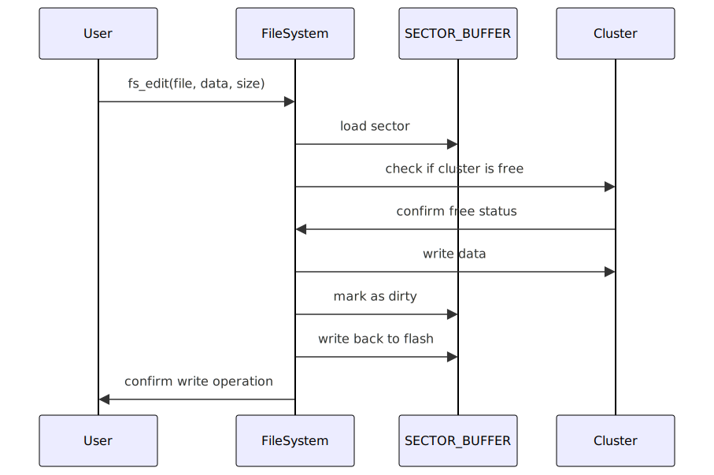

# Communications and Protocols - Worksheet 


**Module Name:** Communications and protocols 

**Module Code:** UFCFVR-15-3

**Module Leader Name:** Frazer Barnes

- [Communications and Protocols - Worksheet](#communications-and-protocols---worksheet)
  - [Description](#description)
    - [Part 1:  How the tables have turned!](#part-1--how-the-tables-have-turned)
    - [Part 2: Storage under the table!](#part-2-storage-under-the-table)
  - [Getting Started](#getting-started)
  - [Authors](#authors)
  - [Version History](#version-history)
  - [License](#license)

## Description
Worksheet 1 Part 2:
- This worksheet provides an exploration of utilizing the Raspberry Pi Pico's flash memory for an Advanced Filesystem using a FAT (File allocation table).

**-This is a rep for worksheet 1 part 1. Other repos:**
* [Communications and Protocols - Worksheet 1](https://gitlab.uwe.ac.uk/jo2-holdsworth/communications-and-protocols-worksheet-1) can be found here
* [Communications and Protocols - Worksheet 1 part 2](https://gitlab.uwe.ac.uk/jo2-holdsworth/communications-and-protocols-worksheet-1-part-2) **you are here**
* [Communications and Protocols - Assignment](https://gitlab.uwe.ac.uk/a2-imeri/picocommprotocol) can be found here

### Part 1:  How the tables have turned!
* Part 1 describes how the FAT filesystem is designed and potential uses cases. The file system is designed to handle lots of small chunks of data efficiently. This was chosen as my interest lies with embedded systems and the kinds of data a file system like this could handle. I plan to utilize a Sub-Gz radio in the assignment and this data structure is design to be compatible.
* ***FAT*** The designed of the FAT system is carefully constructed around the designed for a Sub_Gz radio platform. Focusing on efficiently small data packets and reliability.
  * ***Struct FATable***: This struct is an array of all the files with a count of free clusters to prevent over allocation.
    ```c
    typedef struct {
        FS_FILE entries[100]; // Array holding next cluster index or special values
        uint32_t free_count;  // Number of free clusters available
    } FATable;
    ```
  * ***Struct FS_FILE***:  This is where the magic happens. This struct holds the file name, extension, attributes, datetimes, first cluster, size and if the file is in use. Attributes are used to determine what mode the file can be opened in. 3 dates to help keep track of when the file was created, last accessed and last modified useful for error recovery if a file is lost or being restored. The first cluster is the first cluster of the file following a inode approach daisy chaining clusters together and a ending sequence. This approach is allows for fragmentation of the file and for files to be larger than the flash memory. 
    ```c
    typedef struct {
        char filename[MAX_FILENAME_LENGTH];
        char extension[MAX_EXTENSION_LENGTH];
        uint8_t attributes;
        datetime_t create_datetime;
        datetime_t last_access_datetime;
        datetime_t last_mod_datetime;
        uint16_t first_cluster;
        uint32_t size;
        bool in_use;
    }FS_FILE;
    ```
  * ***Struct SECTOR_BUFFER***: I have implemented a sector buffer to help with the writing of data to flash. This is to prevent the need to write to flash every time a byte is written. The buffer is only written to flash when the buffer is dirty. This allows for the buffer to be written to flash at a later time. This is important as I have multiple clusters per sector (Currently 4) This is to maximize the large sector size of the PICOs flash! The PICO has a 4096 byte sector size which in Sub_Gz radio application would leave a lot of sector space empty there for each sector has 4 clusters. A down side of the is the whole sector must be loaded in memory edited and written back but the pico doesn't have a problem with handling this with its memory size! To handle the clusters within the sectors efficiently was a challenge of the implementation and I think it could have been approached better!
    ```c
    typedef struct {
        uint8_t buffer[SECTOR_SIZE];     // Buffer to hold data before writing to flash
        bool dirty;                      // Flag to indicate if the buffer has modified data
        uint32_t sector;                 // Sector number that this buffer corresponds to
    } SECTOR_BUFFER;
    ```
### Part 2: Storage under the table!
* Part 2 describes the choices made in processing and storing the FAT system to the flash as flash is a different beast to memory.
* ***filesystem.c*** This file contains the logic for processing and storing the FAT system.
  * ***void fs_init()***: fs_init initializes a new filesystem. It creates a new FATable and initializes the flash with sectors and clusters.
    ```c
    void fs_init(){
        uint8_t sector_buffer[SECTOR_SIZE];  // Temporary buffer for a whole sector
        int clusters_per_sector = SECTOR_SIZE / CLUSTER_SIZE;
        // Initialize each sector
        for (int sector_num = 0; sector_num < MAX_SECTORS; sector_num++) {
            CLUSTER* clusters = (CLUSTER*)sector_buffer;

            // Initialize all clusters in this sector
            for (int i = 0; i < clusters_per_sector; i++) {
                memset(clusters[i].buffer, 0, CLUSTER_DATA_SIZE);  // Set cluster data to zeros
                clusters[i].next_cluster = CLUSTER_FREE;  // Indicate no further cluster
            }

            // Write the initialized sector back to flash
            flash_write_safe(sector_num, sector_buffer);
            printf("Debug: Initialized sector %d with empty clusters.\n", sector_num);
        }
    }
    ```
  * ***void fat_init()***: fat_init initializes the File Allocation Table (FAT). The function sets up a FATable structure and initializes it with the maximum number of free clusters. This step is essential as it prepares the FAT with the full capacity of free space available for file storage, making the system ready to allocate space as new files are saved. The actual writing of the FAT data to the storage medium is done through a loop. This loop ensures that all the data from the FATable structure is written to the storage. It uses a sector-by-sector approach, which is a typical method in handling storage devices, allowing for efficient, organized, and safe data writing. Each sector is prepared (cleared and checked for integrity), filled with data from the FATable, and then written to the storage device. This method minimizes the risk of data corruption and ensures that the FAT is reliably stored. Using this approach, the system ensures that the FAT is correctly initialized before any file operations are performed, which is critical for the integrity and accessibility of the files managed by the system. The sector-by-sector initialization and the detailed status messages provide a robust framework for handling potential issues and for maintaining the health and accuracy of the file storage system.
    ```c
    // Initializes the File Allocation Table (FAT).
    void fat_init() {
        // Output message indicating the initialization of the FAT.
        printf("Initializing File Allocation Table...\n");

        // Define and initialize a FATable structure.
        FATable fat;
        fat.free_count = MAX_CLUSTERS;  // Set the number of free clusters to the maximum allowed.
        printf("Free clusters calculated: %u\n", fat.free_count);  // Print the number of free clusters.

        // Create a pointer to the FATable and calculate its total size.
        uint8_t* data = (uint8_t*)&fat;
        size_t total_size = sizeof(FATable);
        size_t written = 0;  // Keep track of the number of bytes written.
        int sector_num = 0;  // Initialize sector number for tracking during the write process.

        // Loop until all the data of the FATable is written.
        while (written < total_size) {
            printf("\nInit sector: %d\n", sector_num);  // Output message indicating the current sector being initialized.
            
            // Initialize a sector buffer to temporarily hold data before writing to storage.
            SECTOR_BUFFER sb = { .sector = -1, .dirty = false };
            memset(sb.buffer, 0 ,SECTOR_SIZE);  // Clear the buffer to make sure it is clean before use.
            
            if (sb.buffer == NULL) {
                printf("Failed to allocate memory for sector buffer.\n");
                break;  // Exit the loop if memory allocation failed.
            }

            // Calculate the number of bytes to write in the current loop iteration.
            size_t bytes_to_write = total_size - written > SECTOR_SIZE ? SECTOR_SIZE : total_size - written;
            memcpy(sb.buffer, data + written, bytes_to_write);  // Copy the calculated bytes from data to the buffer.
            sb.dirty = true;  // Mark the buffer as dirty indicating that it has new data to be written.

            // Write back the initialized sector to storage if the buffer is dirty.
            if (sb.dirty) {
                flash_write_safe(sector_num, sb.buffer);  // Safe write operation to ensure data integrity.
                sb.dirty = false;  // Mark the buffer as not dirty after the data is written.
                printf("FATable data written to sector %d successfully.\n", sector_num);  // Confirm successful write operation.
            }

            written += bytes_to_write;  // Update the count of written bytes.
            sector_num++;  // Move to the next sector.
        }
    }
    ```
  * ***void fat_read()***: The fat_read() function is designed to read and reconstruct a File Allocation Table (FAT) from a storage medium into a given FATable structure in memory. This function is critical for accessing the file system’s metadata, which is necessary to manage files efficiently.
    ```c
    // Initializes the File Allocation Table (FAT).
    void fat_read(FATable* fat) {
        printf("\nreading FATable structure\n");
        SECTOR_BUFFER sb;
        sb.sector = -1;  // Initialize sector to an invalid value

        int total_size = sizeof(FATable);
        int bytes_read = 0;
        int sector_num = 0;

        while (bytes_read < total_size) {
            printf("\nRead loop: Reading sector %d\n", sector_num);

            // Load the sector
            flash_read_safe(sector_num, sb.buffer);
            sb.sector = sector_num;

            // Calculate how much to copy
            int copy_size = total_size - bytes_read;
            if (copy_size > SECTOR_SIZE) {
                copy_size = SECTOR_SIZE;
            }

            // Copy the data from the sector buffer to the FATable structure
            memcpy(((uint8_t*)fat) + bytes_read, sb.buffer, copy_size);
            bytes_read += copy_size;
            sector_num++;  // Move to the next sector
        }

        printf("\nFinished reading FATable structure\n");
    }
    ```
  * ***void fat_write()***: The program is designed to operate with sector-based reading and writing to ensure robustness and reliability in handling file allocation tables. By using sector buffers and managing data transfers in controlled chunks, the program minimizes the risk of data corruption, which is crucial for file system integrity. The choice to implement safe read and write functions, such as flash_read_safe and flash_write_safe, further ensures data integrity during these operations, which is essential for the long-term reliability of the storage system. This approach not only aligns with industry standards but also adapts well to different storage technologies, making the system more versatile.
    ```c
    void fat_write(const FATable* fat) {
        printf("\nWriting FATable structure\n");  // Notify start of write process

        SECTOR_BUFFER sb;
        sb.sector = -1;  // Initialize sector to an invalid value for safety

        int total_size = sizeof(FATable);  // Calculate the total size of the FATable
        int bytes_written = 0;
        int sector_num = 0;

        while (bytes_written < total_size) {
            printf("\nWrite loop: Writing sector %d\n", sector_num);  // Notify which sector is being written

            // Clear the sector buffer to prepare for new data
            memset(sb.buffer, 0, SECTOR_SIZE);
            
            // Determine the number of bytes to write in this iteration
            int write_size = total_size - bytes_written;
            if (write_size > SECTOR_SIZE) {
                write_size = SECTOR_SIZE;
            }

            // Copy the necessary data from the FATable to the sector buffer
            memcpy(sb.buffer, ((uint8_t*)fat) + bytes_written, write_size);

            // Mark the buffer as dirty since it now contains new data
            sb.dirty = true;

            // Write the buffer to storage if it is marked dirty
            if (sb.dirty) {
                flash_write_safe(sector_num, sb.buffer);  // Safe write operation to ensure data integrity
                sb.dirty = false;  // Reset the dirty flag after writing
                printf("FATable data written to sector %d successfully.\n", sector_num);  // Confirm successful write operation
            }

            bytes_written += write_size;  // Update the count of bytes written
            sector_num++;  // Increment to the next sector
        }

        printf("\nFinished writing FATable structure\n");  // Notify end of write process
    }
    ```
  * ***void fs_open()***: In designing the fs_open function, I aimed to provide a flexible and straightforward way to manage file operations within a file system managed by a File Allocation Table (FAT). This function is designed to handle different file access modes, though currently, it primarily supports reading and writing by checking if the mode is "rw". The choice to iterate over all entries in the FAT when searching for a file ensures that each file can be efficiently located by its name, providing a clear and direct way to access files. A better approach could be using a hash table to search more efficiently for bigger file tables?
    ```c
    FS_FILE* fs_open(const char *filename, const char *mode, FATable *fat) {
        // The 'if' condition checks if the mode is "rw".
        if (strcmp(mode, "rw") == 0) {
            // Iterate over all possible file entries in the FAT.
            for (int i = 0; i < MAX_CLUSTERS; i++) {
                FS_FILE *file = &fat->entries[i];  // Get a pointer to the file entry in the FAT.

                // Output the filename and size of each file in the FAT for debugging.
                printf("Filename: %s\n", file->filename);
                printf("File size: %u bytes\n", file->size);

                // Check if the current file's name matches the requested filename.
                if (strcmp(filename, file->filename) == 0) {
                    printf("File size: %u\n", file->size); // Print the size of the found file.
                    return file;  // Return the pointer to the found file.
                }
            }
            return NULL; // Return NULL if the file was not found in the FAT.
        } else if (strcmp(filename, "rwc") == 0) {
            // The 'else if' condition checks if the mode is "rwc", but the body is empty.
            // This part is intended to handle file creation or opening with clearing content,
            // but it needs implementation.
        }

        return NULL; // Return NULL by default if no conditions are met or file is not found.
    }
    ```
  * ***void fs_edit()***: In designing the fs_edit() function, my goal was to ensure a reliable and efficient mechanism for updating files stored in a sector-based file system. The function is structured to handle file modifications at the cluster level, which provides flexibility and minimizes the potential for data corruption by allowing updates to occur in discrete, manageable chunks. The function uses a loop that continues until all data has been written, adopting a strategy that effectively balances between reading and writing operations to optimize performance. By calculating sector and cluster numbers dynamically, it directly addresses the sector that contains the target cluster, which helps in reducing unnecessary read and write operations. Incorporating checks for dirty buffers before proceeding with new operations ensures that any pending changes are committed before new data is fetched or altered, which is crucial for maintaining data integrity. This method prevents data loss and ensures that modifications are correctly written to the storage medium. The decision to verify cluster availability before writing helps in maintaining the file system’s integrity, preventing data from being overwritten accidentally. Furthermore, updating the file’s metadata, such as its size and the last modified timestamp, as part of the write process, ensures that the file system remains consistent and up to date.
    ```c
    void fs_edit(FS_FILE* file, const uint8_t *data, int size) {
        uint32_t remaining_size = size;  // Amount of data left to write.
        uint32_t offset = 0;  // Offset in the data buffer.
        uint16_t cluster_id = file->first_cluster;  // First cluster of the file.
        int clusters_per_sector = SECTOR_SIZE / CLUSTER_SIZE;  // Number of clusters in each sector.

        // Buffer to hold the current sector's data.
        SECTOR_BUFFER sb = { .sector = -1, .dirty = false };

        // Continue until all data is written.
        while (remaining_size > 0) {
            int sector_num = cluster_id / clusters_per_sector;  // Calculate sector number.
            int cluster_num = cluster_id % clusters_per_sector;  // Calculate cluster number within the sector.

            // If the sector in the buffer is not the sector we need, or if it's dirty, update it.
            if (sb.sector != sector_num) {
                if (sb.dirty) {
                    flash_write_safe(sb.sector, sb.buffer);  // Write the dirty buffer to flash.
                    sb.dirty = false;  // Clear the dirty flag.
                }
                flash_read_safe(sector_num, sb.buffer);  // Read the needed sector into the buffer.
                sb.sector = sector_num;  // Update the buffer's sector number.
            }

            // Access the cluster within the buffer.
            CLUSTER* cluster_array = (CLUSTER*)sb.buffer;
            CLUSTER* cluster = &cluster_array[cluster_num];

            // Check if the cluster is free before writing.
            if (is_cluster_free(cluster_id)) {
                uint32_t bytes_to_copy = remaining_size < CLUSTER_DATA_SIZE ? remaining_size : CLUSTER_DATA_SIZE;  // Determine the number of bytes to copy.
                memcpy(cluster->buffer, data + offset, bytes_to_copy);  // Copy data to the cluster.
                offset += bytes_to_copy;  // Increment the offset by the number of bytes copied.
                remaining_size -= bytes_to_copy;  // Decrement the remaining size.
                sb.dirty = true;  // Mark the sector buffer as dirty.

                printf("Debug: Copied %u bytes to cluster %u at offset %u. Remaining size: %u\n", bytes_to_copy, cluster_id, offset, remaining_size);

                // If there's more data to write, find the next free cluster.
                if (remaining_size > 0) {
                    do {
                        cluster_id++;  // Move to the next cluster ID.
                    } while (!is_cluster_free(cluster_id) && cluster_id < MAX_CLUSTERS);

                    // If a free cluster is found, update the cluster linkage.
                    if (is_cluster_free(cluster_id)) {
                        cluster->next_cluster = cluster_id;  // Set the next cluster in the file's chain.
                        printf("Debug: Assigned next free cluster ID %u\n", cluster_id);
                    } else {
                        printf("Error: No free clusters available.\n");
                        return;  // Return if no free clusters are available.
                    }
                } else {
                    cluster->next_cluster = CLUSTER_EOF;  // Mark the end of the file's cluster chain.
                }
            } else {
                printf("Error: Cluster %u is not free.\n", cluster_id);
                return;  // Stop if the current cluster is not free.
            }
        }

        // Write the last modified sector if it's dirty.
        if (sb.dirty) {
            flash_write_safe(sb.sector, sb.buffer);
        }

        // Update the file size if it has increased.
        if (file->size < size) {
            file->size = size;
        }

        // Update the file's last modified timestamp.
        datetime_t t;
        rtc_get_datetime(&t);  // Get the current date and time.
        file->last_mod_datetime = t;  // Set the last modified datetime of the file.

        return;
    }
    ```
  * ***void fs_read()***: In designing the fs_read() function, I aimed to create a reliable and straightforward method for reading entire files from a sector-based file system into memory. This function reads from a structured FS_FILE, ensuring all data is captured accurately and efficiently. The function starts by allocating memory just enough to hold the entire file, which is efficient in terms of memory usage and ensures that only necessary data is loaded into RAM. The check for successful memory allocation immediately after malloc helps safeguard against potential crashes or undefined behavior due to memory issues. To manage data reading efficiently, the function calculates which sector and cluster within that sector need to be accessed. This approach reduces unnecessary reads by directly targeting the relevant storage segments. By managing data in clusters and sectors, the function aligns with the physical organization of storage media, which can improve read performance and minimize wear on the device due to reduced seek times. The loop iterates through each cluster in the file's allocation chain until the entire file is read or the end of the file marker is encountered. This method ensures that files, regardless of their size or the fragmentation in the storage, are read completely and in order. Data is copied from the cluster to a user-space buffer, making the function versatile for various file sizes and types. The function checks for the end-of-file marker in the cluster chain to determine when to stop reading, which ensures that no extraneous data is read, and the file's integrity is maintained.
    ```c
    // Reads the entire content of a file and returns it as a byte array.
    // Parameters:
    //   file: Pointer to the FS_FILE structure representing the file to read.
    uint8_t* fs_read(FS_FILE* file) {
        // Allocate memory for the buffer to hold the file's data.
        uint8_t* buffer = malloc(file->size);
        if (buffer == NULL) {
            printf("Memory allocation failed.\n"); // Check for successful memory allocation.
            return NULL;  // Return NULL if memory allocation fails.
        }
        printf("\nreading");  // Debug print to indicate the reading process starts.

        // Initialize a sector buffer for reading data from storage.
        SECTOR_BUFFER sb;
        sb.sector = -1;  // Initialize the sector number as -1 to ensure the first read.

        // Calculate the number of clusters per sector based on sector and cluster sizes.
        int clusters_per_sector = SECTOR_SIZE / CLUSTER_SIZE;
        uint16_t cluster_id = file->first_cluster;  // Start from the first cluster of the file.
        int offset = 0;  // Initialize offset for data copying.

        // Loop through each cluster in the file's cluster chain.
        for (int i = 0; i <= file->size / CLUSTER_DATA_SIZE; i++) {
            int sector_num = cluster_id / clusters_per_sector;  // Calculate the sector number of the current cluster.
            int cluster_num = cluster_id % clusters_per_sector;  // Calculate the cluster index within the sector.

            printf("\nreadloop");  // Debug print for each loop iteration.
            
            // If the needed sector is not already loaded, load it.
            if (sb.sector != sector_num) {
                flash_read_safe(sector_num, sb.buffer);  // Read the sector safely into the buffer.
                sb.sector = sector_num;  // Update the sector buffer's current sector number.
            }

            // Access the specific cluster within the sector.
            CLUSTER* cluster_array = (CLUSTER*) sb.buffer;
            CLUSTER* cluster = &cluster_array[cluster_num];

            // Determine the size of data to copy from the cluster.
            int copy_size = (i == file->size / CLUSTER_DATA_SIZE && file->size % CLUSTER_DATA_SIZE != 0) ?
                            file->size % CLUSTER_DATA_SIZE : CLUSTER_DATA_SIZE;

            // Copy data from the cluster to the buffer.
            memcpy(buffer + offset, cluster->buffer, copy_size);
            offset += copy_size;  // Increment the offset by the size of the data copied.

            // Check if the end of the file cluster chain is reached.
            if (cluster->next_cluster == CLUSTER_EOF) {
                return buffer; // Return the buffer if end of file is reached.
            }
            cluster_id = cluster->next_cluster;  // Move to the next cluster in the chain.
        }

        // Print the entire file content as characters for debugging.
        for (int i = 0; i < file->size; i++) {
            printf("%c", buffer[i]);
        }
        printf("\n");

        return buffer;  // Return the buffer containing the file data.
    }
    ```
  * ***void fs_write()***: In designing the fs_write() function, I chose an approach that optimizes for robustness and precision in managing data writes within a file system that operates on a cluster-based structure. The implementation ensures that each write operation is precise, directly addressing the necessary clusters and sectors, and taking care to maintain the integrity of the file system's structure. Cluster and Sector Management: The function is carefully structured to write data by calculating the precise sector and cluster that need to be accessed. This minimizes unnecessary reads and writes, enhancing performance and reducing wear on the storage medium. By using a sector buffer and keeping track of its state, the function ensures that any changes are first written back safely before new data is read or written to the buffer. This is essential for preventing data corruption and loss. Data Integrity and Error Handling: The function checks if each cluster is free before writing to it, which prevents overwriting data unintentionally and helps maintain the integrity of stored data. The use of a loop to find the next free cluster ensures that the file's data is stored contiguously as much as possible, which can improve read performance later. Additionally, if no free clusters are available or if an assigned cluster is not free, the function returns an error, immediately notifying the system of the issue.Final Write and File Size Update: The function concludes by ensuring any remaining dirty sectors are written to storage, securing all changes made during the operation. It also updates the file size if the written data exceeds the previous size of the file, ensuring the file metadata accurately reflects the current state.
    ```c
    int fs_write(FS_FILE* file, const uint8_t *data, int size) {
        uint32_t remaining_size = size;  // Track the amount of data left to write.
        uint32_t offset = 0;  // Offset in the input data buffer.
        uint16_t cluster_id = file->first_cluster;  // Start at the first cluster of the file.
        int clusters_per_sector = SECTOR_SIZE / CLUSTER_SIZE;  // Determine how many clusters each sector holds.
        SECTOR_BUFFER sb = { .sector = -1, .dirty = false };  // Initialize a sector buffer.

        while (remaining_size > 0) {  // Loop until all data is written.
            int sector_num = cluster_id / clusters_per_sector;  // Calculate the sector number for the current cluster.
            int cluster_num = cluster_id % clusters_per_sector;  // Determine the cluster's position within its sector.

            // Load the sector if it's not already loaded, or if it's dirty.
            if (sb.sector != sector_num) {
                if (sb.dirty) {
                    flash_write_safe(sb.sector, sb.buffer);  // Write back the dirty sector to storage.
                    sb.dirty = false;
                }
                flash_read_safe(sector_num, sb.buffer);  // Read the new sector into the buffer.
                sb.sector = sector_num;  // Update the sector number in the buffer.
            }

            // Access the cluster within the sector.
            CLUSTER* cluster_array = (CLUSTER*)sb.buffer;
            CLUSTER* cluster = &cluster_array[cluster_num];

            // Only write to the cluster if it's free.
            if (is_cluster_free(cluster_id)) {
                // Determine how much data to copy to this cluster.
                uint32_t bytes_to_copy = remaining_size < CLUSTER_DATA_SIZE ? remaining_size : CLUSTER_DATA_SIZE;
                memcpy(cluster->buffer, data + offset, bytes_to_copy);
                offset += bytes_to_copy;
                remaining_size -= bytes_to_copy;
                sb.dirty = true;  // Mark the sector as dirty.

                printf("Debug: Copied %u bytes to cluster %u at offset %u. Remaining size: %u\n", bytes_to_copy, cluster_id, offset, remaining_size);

                // If there is still data left, find the next free cluster.
                if (remaining_size > 0) {
                    do {
                        cluster_id++;
                    } while (!is_cluster_free(cluster_id) && cluster_id < MAX_CLUSTERS);

                    if (is_cluster_free(cluster_id)) {
                        cluster->next_cluster = cluster_id;  // Update the file's cluster chain.
                        printf("Debug: Assigned next free cluster ID %u\n", cluster_id);
                    } else {
                        printf("Error: No free clusters available.\n");
                        return -1;  // Return error if no free clusters are found.
                    }
                } else {
                    cluster->next_cluster = CLUSTER_EOF;  // Mark the end of the file cluster chain.
                }
            } else {
                printf("Error: Cluster %u is not free.\n", cluster_id);
                return -1;  // Return error if the cluster is not free.
            }
        }

        // Write any remaining dirty sector to storage.
        if (sb.dirty) {
            flash_write_safe(sb.sector, sb.buffer);
        }

        // Update the file size if the new data exceeds the existing file size.
        if (file->size < size) {
            file->size = size;
        }

        // Return the number of bytes written (could be modified to return actual bytes written).
        return offset;
    }
    ```

  * ***Testing***:
    ```c
    void test_rtc_init_and_set() {
        datetime_t t = {
            .year = 2020, .month = 6, .day = 5, .dotw = 5, .hour = 15, .min = 45, .sec = 0
        };
        rtc_init();
        int set_result = rtc_set_datetime(&t);
        printf("RTC initialized and datetime set with result: %d\n", set_result);
    }

    void test_usb_connection() {
        while (!stdio_usb_connected()) {
            printf("Waiting for USB connection...\n");
            sleep_ms(100);
        }
        printf("USB connection established.\n");
    }
    void test_fat_init() {
        fat_init();
        printf("FAT initialized successfully.\n");
    }

    void test_fat_read() {
        FATable fat;
        fat_read(&fat);
        printf("Read FAT. Free clusters available: %u\n", fat.free_count);
    }

    void test_fs_write_and_read() {
        FS_FILE file = {
            .filename = "testfile", .extension = "txt", .attributes = 0,
            .create_datetime = 0, .last_access_datetime = 0, .last_mod_datetime = 0,
            .first_cluster = 100, .size = 0, .in_use = true
        };
        const uint8_t data[] = "Hello, world!Hello, world!Hello, world!Hello, world!Hello, world!Hello";
        int write_result = fs_write(&file, data, sizeof(data));
        if (write_result == 0) {
            printf("Data written successfully.\n");
        } else {
            printf("Error writing data.\n");
        }

        FS_FILE* found_file = fs_open("testfile", "w", &fat);
        if (found_file != NULL) {
            uint8_t* buffer = fs_read(found_file); // Implement fs_read function
            if (buffer != NULL) {
                printf("File read successfully, content: %s\n", buffer);
                free(buffer);
            } else {
                printf("Error reading file content.\n");
            }
        } else {
            printf("File not found or error opening file.\n");
        }
    }

    void test_fs_create_and_delete() {
        FS_FILE new_file = {
            .filename = "newfile", .extension = "tmp", .attributes = 0,
            .create_datetime = 0, .last_access_datetime = 0, .last_mod_datetime = 0,
            .first_cluster = 100, .size = 0, .in_use = true
        };
        // Simulate file creation
        int create_result = fs_create(&new_file);
        if (create_result == 0) {
            printf("File created successfully.\n");
        } else {
            printf("Error creating file.\n");
        }

        // Simulate file deletion
        int delete_result = fs_delete(&new_file);
        if (delete_result == 0) {
            printf("File deleted successfully.\n");
        } else {
            printf("Error deleting file.\n");
        }
    }
    void test_fs_error_handling() {
        FS_FILE* null_file = NULL;
        const uint8_t data[] = "Temporary data";
        // Attempt to write using a NULL file pointer
        int write_result = fs_write(null_file, data, sizeof(data));
        printf("Writing to a NULL file pointer resulted in: %d\n", write_result);

        // Attempt to open a file that does not exist
        FS_FILE* file = fs_open("nonexistent", "r", NULL);
        if (file == NULL) {
            printf("Correctly handled attempt to open a nonexistent file.\n");
        } else {
            printf("Error: Managed to open a file that should not exist.\n");
        }
    }
    ```
    * **cmd**:
      `mkdir build`
      `cd build`
      `cmake ..`
      `cd task1`
      `make -j8`
      copy uf2 file to pico board in bootloader mode.
___

___
## Getting Started
* `git clone https://gitlab.uwe.ac.uk/jo2-holdsworth/communications-and-protocols-worksheet-1-part-2`


## Authors

Contributors names and contact info

ex. Jack Holdsworth @ [my website](https://holdsworth.dev)

## Version History
* 0.4
  * task 3
* 0.3
  * task 2 done
  * started task 3
* 0.2
  * most of task 2 done
  * README made
* 0.1
  * init.

## License
This project is licensed under the GPL License - see the LICENSE.md file for details
No text detected.
Try a screenshot instead.

0
:
00
